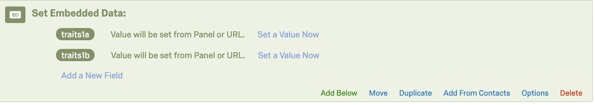

# Embedded data for conjoint experimental designs

This is an addition to the conjoint experimental design example provided by Thomas Leeper [here](https://github.com/leeper/conjoint-example). 

It is only meant to clarify exactly how to set up embedded data on Qualtrics. 
Following this 
```js
Qualtrics.SurveyEngine.setEmbeddedData('traits1a', traits_a.join("|"));
Qualtrics.SurveyEngine.setEmbeddedData('traits1b', traits_b.join("|"));
```
Enter this in the ‘Set Embedded Data’ section of the Survey Flow:
 


# Analyze

An alternative to separating the single character variable in your output data into separate variables is using extract() through dplyr in R.

An example of this with two attributes from the Leeper example is: 

```R
data %>% 
  extract(attribute_column, c("Sex", "Occupation")
          regex = "(^Male$|^Female$)|(^State Governor$|^U.S. Senator$|^Member of Congress$|^CEO$)",
          remove = FALSE)
```

The regular expression (regex = ) must be a single line.
